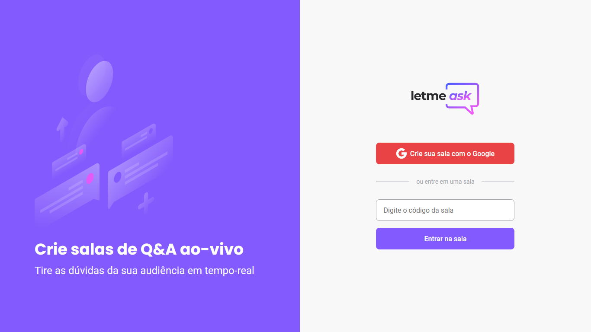

<p align="center">
  
</p>

<h1 align="center">
    
</h1>

<br>

##### Application developed from Next Level Week Together! **NLW#06  - ReactJS Track** hosted by [Rocketseat](https://rocketseat.com.br/). 
Letmeask developed to facilitate interaction between people to create questions and answers.

---

Deploy: https://letmeask-638d7.web.app

## 🧪 Technologies

Application developed using the following technologies:

- [React](https://reactjs.org)
- [Firebase Authentication](https://firebase.google.com/products/auth)
- [Firebase Realtime Database](https://firebase.google.com/products/realtime-database)
- [TypeScript](https://www.typescriptlang.org/)
- [Sass](https://sass-lang.com/install)

## 🚀 Getting started

### Requirements

- You need to install both [Node.js](https://nodejs.org/en/download/) and [Yarn](https://yarnpkg.com/) to run this project.

Clone the project and access the folder.

```bash
$ git clone https://github.com/felipe-gomes-vicente/letmeask-nlw-06-reactjs.git
$ cd letmeask-nlw-06-reactjs
```

Follow the steps below:
```bash
# Install the dependencies
$ yarn

# Start the project
$ yarn start
```
The app will be available for access on your browser at http://localhost:3000


## 📝 License

This project is licensed under the MIT License. See the [LICENSE](LICENSE.md) file for details.


---

<p align="center">Made with 💜 by Felipe Vicente👋</p>  

- ## My LinkedIn - [](https://www.linkedin.com/in/felipe-gomes-vicente/) 
